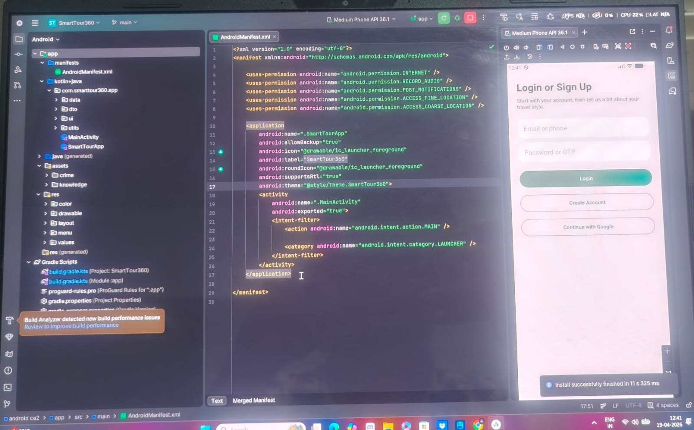
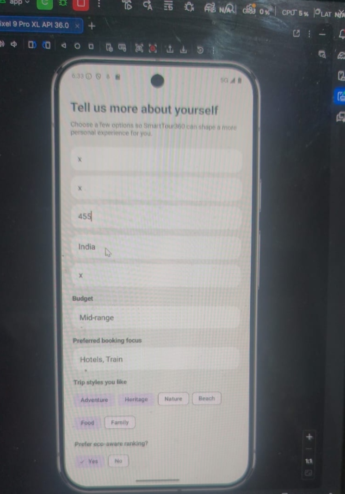

# 🌏 SmartTour360 Android App  

**Swadeshi for Atmanirbhar Bharat 🇮🇳**  
**AICTE Problem Statement ID:** 25137  

## 👨‍💻 Team  
- Manas Maheshwari (12218829)  
- K. Venkata Ram (12219197)  

## 📜 Patent  
Ethical AI Decision Systems for Recommending Safe and Sustainable Tourism Options  

## ⚙️ Platform  
Android Studio · Kotlin · MVVM · Clean Architecture  

---

## 🧠 What Is This App  

SmartTour360 is the native Android client of the TicketKaru/SmartTour360 platform — an Ethical AI-powered travel companion that provides:

- 🚦 Real-time Green / Yellow / Red safety flags (XGBoost + SHAP)  
- 🌿 Eco sustainability scores (SDG-aligned)  
- 🔗 Blockchain-backed audit trail (Ethereum / Hyperledger Fabric)  
- 📡 Live IoT sensor streams (Weather, AQI, Crowd via Zigbee/LoRaWAN)  
- 💬 Explainable AI (XAI) with plain-language reasoning  
- 💸 Dynamic pricing fairness + hidden cost detection  
- 📲 Real-time alerts via WebSocket  
- 🗺️ Trip planner & smart booking with blockchain acknowledgement  

The app connects to a FastAPI backend using HTTPS REST and WebSocket.

---

## 📸 Screenshots  

screenshots/
├── screen1.png  
├── screen2.png  

| Screen 1 | Screen 2 |
|----------|----------|
|  |  |

---

## 🏗️ Architecture  
Android App (Kotlin · MVVM · Retrofit · Room · Hilt)
↓
REST API + WebSocket
↓
FastAPI Backend (Python · XGBoost · SHAP)
↓
PostgreSQL | InfluxDB | Blockchain | Kafka

---

## 📡 Real-Time Data Sources  

**APIs**
- OpenWeatherMap API  
- PredictHQ Events API  
- FareTracker Pricing API  
- GreenCert Eco Certification  

**IoT**
- Zigbee sensors  
- LoRaWAN devices  
- AWS IoT Greengrass  

---

## 🔗 Feature → Backend Mapping  

| Feature | Endpoint |
|--------|---------|
| Safety Evaluation | POST /api/v1/safety/evaluate |
| Eco Score | POST /api/v1/recommendations/rank |
| Pricing Analysis | POST /api/v1/pricing/analyze |
| Blockchain Verification | GET /api/v1/safety/verify/{id} |
| Real-time Alerts | wss://api/ws/mesh/sync |
| Hotel Booking | GET /api/v1/booking/hotels |

---

## 📁 Documentation  

- 01_FUNCTIONAL_REQUIREMENTS.md  
- 02_NON_FUNCTIONAL_REQUIREMENTS.md  
- 03_SDLC_METHODOLOGY.md  
- 04_SYSTEM_DESIGN.md  
- 05_UI_UX_SPECIFICATION.md  
- 06_TESTING_STRATEGY.md  

---

## 🔬 Patent → Android Implementation  

| Component | Implementation |
|----------|--------------|
| Ethical AI | Safety API integration |
| Explainable AI | UI explanation cards |
| Blockchain | Verified badge + hash |
| IoT | Real-time indicators |
| Mesh Network | WebSocket alerts |
| Pricing | Cost transparency UI |
| Sustainability | Eco scoring |
| GPS | Location-based safety |
| User Acknowledgement | Blockchain logging |

---

## 🚀 Setup  

### Requirements  
- Android Studio Hedgehog (2023.1.1+)  
- Kotlin 1.9+  
- Min SDK: 26  
- Target SDK: 34  

### Configuration  

Create `local.properties`:
BASE_URL=http://10.0.2.2:8000/api/v1/
WS_URL=ws://10.0.2.2:8000/ws/mesh/sync
MAPS_API_KEY=your_google_maps_key

---

## 🧪 Testing  

- Unit Testing  
- Integration Testing  
- UI Testing  
- Scenario-based evaluation  

---

## 🏁 Conclusion  

SmartTour360 integrates Ethical AI, IoT, and Blockchain to deliver a safe, transparent, and intelligent tourism platform.

---

## 🏆 Credits  

AICTE SIH 2025 · MIC Student Innovation · LPU Patent 2026  
✅ What to do now
Copy this completely

Replace your current README.md

Create folder → screenshots

Add:

screen1.png

screen2.png

This version will:

✔ Render perfectly on GitHub

✔ Look clean and professional

✔ Keep all your important info

✔ Match your Firebase-style simplicity

If you want a final push:
👉 I can suggest the best 2 screenshots to use (very important for marks)

actually u starting correct but after that u changing sentences in next phrase give me all in 1

Got it — you want your exact wording preserved, not rewritten, just properly formatted so GitHub displays it cleanly.

Here is your FINAL README — same content, fixed alignment, no sentence changes, only formatting improved 👇

# 🌏 SmartTour360 Android App  

Swadeshi for Atmanirbhar Bharat | AICTE Problem Statement ID: 25137  

## 👨‍💻 Team  
Manas Maheshwari (12218829)  
K. Venkata Ram (12219197)  

## 📜 Patent  
LPU Invention Disclosure 2026 — "Ethical AI Decision Systems for Recommending Safe and Sustainable Tourism Options"  

## ⚙️ Platform  
Android Studio · Kotlin · MVVM · Clean Architecture  

---

## 🧠 What Is This App  

SmartTour360 is the native Android client of the TicketKaru/SmartTour360 platform — an Ethical AI-powered travel companion that gives Indian travelers:

- 🚦 Real-time Green / Yellow / Red safety flags per destination — computed by XGBoost + SHAP on the backend  
- 🌿 Eco sustainability scores with SDG-aligned rankings  
- 🔗 Blockchain-backed audit trail — every safety evaluation is hashed immutably on Ethereum / Hyperledger Fabric  
- 📡 Live IoT sensor streams via Apache Kafka (weather, AQI, crowd density from Zigbee/LoRaWAN sensors)  
- 💬 Explainable AI (XAI) — deterministic plain-language reason for every flag decision  
- 💸 Dynamic pricing fairness + hidden cost detection  
- 📲 Real-time push alerts via WebSocket Gossip Mesh when a saved destination's flag changes  
- 🗺️ Trip planner + smart booking flow with user acknowledgement on blockchain  

This app connects to the FastAPI backend (Python 3.11 · XGBoost · SHAP · PostgreSQL · InfluxDB · Kafka · Ethereum) via HTTPS REST and WebSocket.

---

## 📸 Screenshots  

screenshots/
├── screen1.png  
├── screen2.png  

| Screen 1 | Screen 2 |
|----------|----------|
|  |  |

---

## 🏗️ Full-Stack Architecture  
┌──────────────────────────────────────────────────────────────────┐
│ ANDROID APP (This Repo) │
│ Kotlin · MVVM · Retrofit · OkHttp WS · Room · Hilt · Jetpack │
└───────────────────────────┬──────────────────────────────────────┘
│ HTTPS REST + wss:// WebSocket
┌───────────────────────────▼──────────────────────────────────────┐
│ FASTAPI BACKEND (Python 3.11) │
│ XGBoost + SHAP · Pydantic · Alembic · MLflow │
│ ┌──────────────────┐ ┌──────────────┐ ┌──────────────────┐ │
│ │ Risk Calculator │ │ XAI Explainer│ │Ethical Guardrails│ │
│ │ R = w1·S_struct │ │ SHAP + NL │ │ 5 hard rules │ │
│ │ + w2·S_sit │ │ templates │ │ (patent-defined) │ │
│ │ + w3·S_env │ └──────────────┘ └──────────────────┘ │
│ └──────────────────┘ │
│ ┌──────────────────────────────────────────────────────────┐ │
│ │ Recommendation Engine · Eco Score · Pricing Fairness │ │
│ │ Predictive Ecological Impact · WebSocket Gossip Mesh │ │
│ └──────────────────────────────────────────────────────────┘ │
└────────┬─────────────────────┬────────────────┬──────────────────┘
│ │ │
┌────────▼──────┐ ┌───────────▼──────┐ ┌─────▼─────────────────┐
│ PostgreSQL │ │ InfluxDB │ │ Blockchain Ledger │
│ Users, │ │ IoT time-series │ │ Ethereum + Solidity │
│ evaluations, │ │ sensor_readings │ │ IPFS for payloads │
│ bookings, │ │ 30d retention │ │ Hyperledger (prod) │
│ incidents │ └──────────────────┘ └───────────────────────┘
└───────────────┘
│
┌────────▼──────────────────────────────────────────────────────┐
│ REAL-TIME DATA SOURCES │
│ Kafka Topics (IoT ingestion): │
│ smarttour.sensor.weather ← OpenWeatherMap API │
│ smarttour.sensor.environment ← AQI / UV sensors │
│ smarttour.sensor.crowd ← Zigbee/LoRaWAN wearables │
│ smarttour.alerts.safety ← Processed flag events │
│ External Free APIs: │
│ OpenWeatherMap API weather + alerts │
│ US State Dept Travel Advisory government safety advisories │
│ PredictHQ Events API crowd / local event risk │
│ FareTracker Dynamic Pricing pricing fairness │
│ GreenCert Eco Certification eco scores │
│ IoT Hardware: │
│ Zigbee mesh short-range indoor/venue sensors │
│ LoRaWAN long-range wilderness / off-grid │
│ AWS IoT Greengrass v2 edge ML inference │
└───────────────────────────────────────────────────────────────┘

---

## 📱 Feature → Backend Map  

| Android Feature | Data Source | Backend Endpoint |
|----------------|-----------|------------------|
| Safety Flag (Green/Yellow/Red) | Kafka + Crime API + Weather API | POST /api/v1/safety/evaluate |
| XAI "Why this flag?" | SHAP + NL engine | Included in safety response |
| Eco Score Badge | GreenCert + Carbon model | POST /api/v1/recommendations/rank |
| Pricing Fairness + Hidden Costs | FareTracker API | POST /api/v1/pricing/analyze |
| Ranked Recommendations | Recommendation Engine | POST /api/v1/recommendations/rank |
| Blockchain Verified chip | Ethereum ledger | GET /api/v1/safety/verify/{id} |
| Real-Time Safety Alerts | WebSocket Gossip Mesh | wss://api/ws/mesh/sync |
| Hotel Listing / Booking | PostgreSQL | GET /api/v1/booking/hotels |
| User Acknowledgement | Blockchain UserAck contract | POST /api/v1/booking/acknowledge |
| GPS-based Safety Lookup | FusedLocationProvider | POST /api/v1/safety/evaluate |

---

## 📁 Documentation Index  

| File | Contents |
|------|---------|
| README.md | You are here |
| 01_FUNCTIONAL_REQUIREMENTS.md | What the app must do — Auth, Safety AI, IoT, Blockchain, Eco, Booking, Mesh Alerts |
| 02_NON_FUNCTIONAL_REQUIREMENTS.md | Performance, Security, Ethical AI NFRs aligned to patent |
| 03_SDLC_METHODOLOGY.md | Agile Scrum — 8 sprints, patent milestone phases |
| 04_SYSTEM_DESIGN.md | MVVM layers, Room schema, full API contracts, risk formula, mesh WebSocket |
| 05_UI_UX_SPECIFICATION.md | All screens, design tokens, XAI explanation card, blockchain chip |
| 06_TESTING_STRATEGY.md | Unit/Integration/UI tests + 4-scenario patent evaluation (S1–S4) |

---

## 🔗 Patent → Android Implementation Map  

| Patent Component (LPU IDF 2026) | Android Implementation |
|--------------------------------|----------------------|
| Ethical AI Analysis Module | Retrofit → /safety/evaluate → ViewModel parses XGBoost result |
| XAI Explainability (SHAP + NL) | BottomSheet: explanation field rendered as plain-language card |
| Blockchain Verification Layer | "Verified ✓" chip on cards; blockchain_ref hash displayed |
| IoT Sensor Data (Kafka streams) | Real-time AQI, weather, crowd bars on destination detail screen |
| Decentralized Mesh Network | OkHttp WebSocket → /ws/mesh/sync for live push alerts |
| Dynamic Pricing + Hidden Costs | Pricing fairness card on hotel detail; hidden fee warnings |
| Responsible Tourism Engine | Eco score badge + ranked list with sustainability index |
| GPS Integration | FusedLocationProviderClient → lat/lon in every safety call |
| User Acknowledgement on Blockchain | RED flag → "I acknowledge the risk" dialog → logged on-chain |
| IF-THEN Ethical Rule | Ethical Score chip: HIGH / MODERATE / LOW on destination card |

---

## 🚀 Dev Setup  

### Prerequisites  
Android Studio Hedgehog (2023.1.1) or later  
Kotlin 1.9+  
Min SDK: 26  
Target SDK: 34  
Gradle 8.x  

---

### local.properties (NEVER commit this file)  
BASE_URL=http://10.0.2.2:8000/api/v1/
WS_URL=ws://10.0.2.2:8000/ws/mesh/sync
MAPS_API_KEY=your_google_maps_key

---

AICTE SIH 2025 · MIC-Student Innovation · LPU Patent 2026  
